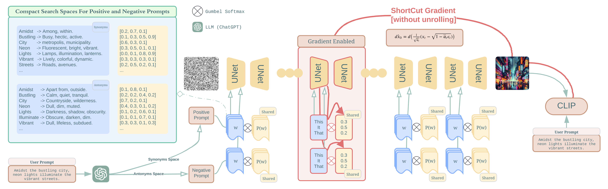

## On Discrete Prompt Optimization for Diffusion Models - ICML 2024


<br>


<br>


<br>

Official implementation of [DPO-Diff](https://arxiv.org/abs/2407.01606v1), accepted by ICML 2024.

> [**[ICML 2024] On Discrete Prompt Optimization for Diffusion Models**](https://arxiv.org/abs/2407.01606v1)
> [Ruochen Wang](https://ruocwang.github.io/),
> [Ting Liu](http://www.tliu.org/),
> [Cho-Jui Hsieh](https://web.cs.ucla.edu/~chohsieh/),
> [Boqing Gong](http://boqinggong.info/)
> <br>**Google Research, Deepmind, UCLA**<br>


<table class="center">
    <tr>
    <td width=100% style="border: none"></td>
    </tr>
    <tr>
    <td width="100%" style="border: none; text-align: center; word-wrap: break-word">Overview of DPO-Diff pipeline.
</td>
  </tr>
</table>


**Abstract**: DPO-DIFF is the first **search-based prompt optimization framework** for improving the prompt-following ability of diffusion models. DPO-DIFF enjoys high degree of versatility:
- Readily applicable to both **Prompt Improvement** and **Adversarial Attack** tasks
- Can Optimize both **Positive Prompts** and **Negative Prompts**
- Support a variety of diffusion model backbones
- Include both **White-box** (gradient-based) and **Black-box** (evolution-based) optimization algorithms.


<!-- <table class="center">
    <tr>
    <td width=100% style="border: none"></td>
    </tr>
    <tr>
    <td width="100%" style="border: none; text-align: center; word-wrap: break-word">Text prompt: A beautiful
</td>
  </tr> -->
</table>

#### TODOs
- [ ] Example hard Prompts for adversarial attack
- [ ] Visualizations for README

---

# 📝 Preparations

🛠️ **1. Setup Environment**

To set up the environment for this project, run the following commands in your terminal:

```bash
conda create -n dpo-diff python=3.8
conda install pytorch==2.0.0 torchvision==0.15.0 torchaudio==2.0.0 pytorch-cuda=11.7 -c pytorch -c nvidia
pip install diffusers==0.24.0
pip install accelerate==0.24.1
pip install transformers==4.35.2
pip install matplotlib==3.7.3
pip install openai==1.3.0
pip install nltk==3.8.1
pip install gpustat==1.1.1
pip install sentence-transformers
```

🔑 **2. OpenAI Account**

We use `GPT-4` to generate the synonym and antonym space. To enable GPT-4 access, create a file under `files/openai_key.txt`.


🛣️ **3. Directories**

Paths used in this projects are stored in `src/prompts/path.py` file, which can be modified accordingly.


⚙️ **4. GPU Requirement**

With Stable Diffusion v1 and v2-base (512x512 resolution), running DPO-Diff with hybrid or gradient-based optimization requires around 15-20G of GPU memory.
DPO-Diff with evolution-based algorithm can run on GPUs with only 8-9G memory.


# Run DPO-Diff

## **😇 Optimizing Negative Prompt for Prompt Improvement Task**

In diffusion models, negative prompts specify "what to exclude" from the generated images.
Below are the instructions for optimizing negative prompts using DPO-Diff.
For more research on how negative prompts work, we refer the reader to the following paper:

> [Understanding the Impact of Negative Prompts: When and How Do They Take Effect?](https://arxiv.org/abs/2406.02965)<br>
> Yuanhao Ban, Ruochen Wang, Tianyi Zhou, Minhao Cheng, Boqing Gong, Cho-Jui Hsieh


### **1. Generate Search Space**

**Antonym Space**

We build a search space from the opposite word of each word in the user prompt, obtained by querying LLMs.
In principle, the Antonym Space ought to be generated on-the-fly based on the user prompt.
To avoid repeatedly querying LLMs for during the experiments, we pre-generate the search space offline.

> ```Bash
> bash build_search_space.sh --name antonym --prompt_path <path/to/prompt/file> --model gpt-4 --mode keyword
> ```

> - `--name` is the name of the space, which could be antonym or synonym.
> - `--model` specifies which LLM model (gpt-4 or gpt-3.5-turbo) to use for generating the word substitutes
> - `--mode`: the "default" mode will ask LLMs to propose subsitutes for all words, whereas the "keyword" mode focuses only on the keywords in the user prompt.
> - `--prompt_path` points to a json file stores all prompts to be processed.

Below is a snapshot of an example prompt file:

```json
{
    "This American city street has one-way traffic only": 0.8571,
    "A bird standing on top of a wet beach.": 0.8963,
    ...
}
```
The numbers are the spherical CLIP loss (usually ranges around 0.7 to 1.0) between the original prompt and the generated images. High losses indicate (in CLIP model's mind) that the image generation does not faithfully follow the prompts. During evaluation, we focus on hard prompts - those with a high CLIP loss for prompt improvement task and those with a low CLIP loss for adversarial attack task.


The generated antonym space for each prompt is stored in the following json format, and will be save to the same folder as your prompt file.

```json
  "a plane flies through the air with fumes coming out the back ": {
      "antonym": {
          "plane": [ "train", "car", "boat", "bike", "walk" ],
          "flies": [ "drops", "descends", "falls", "plummets", "sinks" ],
          "air": [ "water", "earth", "sand", "ground", "soil" ],
          "fumes": [ "oxygen", "fragrance", "scent" ],
          "back": [ "front", "top", "side", "fore", "ahead" ]
      },
      "prompt_id": 3,
      "prompt": "a plane flies through the air with fumes coming out the back "
  },
```


### NPLib Space: Negative Prompt Library

In addition to Antonym Space, we also curate a collection of universal negative prompts crafted and used by human engineers stored in `data/prompts-negative-filtered.txt` and `data/prompts-negative-filtered-v2.txt`.
The collection mainly comes from the following sources:
- [mikhail-bot/stable-diffusion-negative-prompts](https://github.com/mikhail-bot/stable-diffusion-negative-prompts)
- [Negative Prompts in Stable Diffusion: A Beginner’s Guide](https://www.greataiprompts.com/imageprompt/what-is-negative-prompt-in-stable-diffusion/)

Here are few example negative prompts:

```markdown
Amputee
Asymmetric
Blurry
Boring
Branding
Conjoined
Corpse
...
```


### **2. Run Search**

We've prepared the following script to run DPO-Diff with Hybrid Prompt Optimizer (HPO), Gradient-based Prompt Optimizer (GPO) and Evolution-based Prompt Optimizer (EPO).
They can be found under `./scripts` folder.

**HPO Hybrid Prompt Optimizer**
>```Bash
>bash run-improve.sh \
>  --algo_config hybrid.yaml.yaml \
>  --task_config improve-antonym/improve-nplib.yaml \
>  --path [path/to/pregenerated/space]
>```

**EPO: Evolution-based Prompt Optimizer**
>```Bash
>bash run-improve.sh \
>  --algo_config epo.yaml.yaml \
>  --task_config improve-antonym/improve-nplib.yaml.yaml \
>  --path [path/to/pregenerated/space]
>```

**GPO: Gradient-based Prompt Optimizer**
>```Bash
>bash run-improve.sh \
>  --algo_config gpo.yaml \
>  --task_config improve-antonym/improve-nplib.yaml \
>  --path [path/to/pregenerated/space]
>```

> - `--gpu` specifies the GPU id. Defaults to "auto", which allows the script to automatically select the GPU with lowest memory usage.
> - `--version` is the Stable Diffusion version. Defaults to "v1-4"
> - `--path` is path to the file that stores pre-generated search space.
> - `--prompt_id` specifies which prompt(s) from the pre-generated search space to run on. You can feed a comma separated list of ids to it (e.g. `0,1,2`).
> - `--algo_config` is the configuration file for the search algorithm. Available examples are stored i.yamln `src/configs/algo` folder.
> - `--task_config` is the configuration file for the tasks (prompt improvement or adversarial attack).yaml. Available examples are stored in `src/configs/task` folder.

---

## **😈 Optimizing Positive Prompt for Adversarial Task**

DPO-Diff can be readily extended to adversarial task with only one additional consideration: When crafting the adversarial prompt for diffusion models, the meaning of the modified prompt cannot deviate too much from the original user prompt. This resembles the epsilon-bounded pertubation in traditional adversarial settings.

**Measuring prompt similarities**

To quantitatively measure the similarity between a pair of prompts, we compute their cosine similarity in `sentence-T5`'s embedding space. This constraint (including its threshold) is specified in the task configuration file `src/configs/task/attack`.

**Incorporate similarity constraint to the solver**

When solving the constraint DPO-Diff problem, there are many ways to honor the constrant in the solver. We opt for rejection sampling for all optimizers (HPO, GPO, EPO) due to its simplicity.


### **1. Generate Search Space**

**Synonym Space**

We build a search space from the synonyms of each word in the user prompt, obtained by querying LLMs.
In principle, the Synonym Space ought to be generated on-the-fly based on the user prompt.
To avoid repeatedly querying LLMs for during the experiments, we pre-generate the search space offline.
Similar to Antonym Space, Synonym Space can be generated by running:

>```Bash
>bash build_search_space.sh --name antonym --prompt_path <path/to/prompt/file> --model gpt-4 --mode keyword
>```

The generated synonym space for each prompt is stored in the following json format:

```json
  "a plane flies through the air with fumes coming out the back ": {
      "synonym": {
          "plane": [ "aircraft", "jet", "airplane", "airliner", "airship" ],
          "flies": [ "glides", "soars", "travels", "cruises", "propels" ],
          "through": [ "across", "over", "in", "within", "amidst" ],
          "air": [ "sky", "atmosphere", "airspace", "firmament", "heavens" ],
          "with": [ "having", "containing", "possessing", "encompassing", "comprising" ],
          "fumes": [ "smoke", "exhaust", "emissions", "gases", "vapors" ],
          "coming out": [ "emanating", "releasing", "discharging", "expelling", "emanating" ],
          "back": [ "rear", "behind", "tail", "end", "aft" ]
      },
      "prompt_id": 3,
      "prompt": "a plane flies through the air with fumes coming out the back "
  },
```

### **2. Run Search**

We've prepared the following script to run DPO-Diff with Hybrid Prompt Optimizer (HPO), Gradient-based Prompt Optimizer (GPO) and Evolution-based Prompt Optimizer (EPO).
They can be found under `./scripts` folder.

**HPO Hybrid Prompt Optimizer**
>```Bash
>bash run-attack.sh \
>  --algo_config hybrid.yaml \
>  --task_config attack-synonym.yaml \
>  --path [path/to/pregenerated/space]
>```

>**EPO: Evolution-based Prompt Optimizer**
>```Bash
>bash run-attack.sh \
>  --algo_config epo.yaml \
>  --task_config attack-synonym.yaml \
>  --path [path/to/pregenerated/space]
>```

>**GPO: Gradient-based Prompt Optimizer**
>```Bash
>bash run-attack.sh \
>  --algo_config gpo.yaml \
>  --task_config attack-synonym.yaml \
>  --path [path/to/pregenerated/space]
>```


---


## Known Limitations and Followup Works

We position DPO-Diff as an experimental attempt to solve prompt optimization prollem for diffusion models under search-based paradigm, and we expect many limitations for this preliminary work. Below are two areas we identified while exploring DPO-Diff, which leads to some follow-up papers:

We position DPO-Diff as an experimental approach to address prompt optimization problems for diffusion models within a search-based framework.
As preliminary work, it comes with several limitations. Here are two specific areas we've explored while working on DPO-Diff, leading to subsequent research:

### How does negative prompt work in text-to-image generation?

Negative Prompts are widely adopted in practical applications of diffusion models.
While DPO-Diff has shown that optimizing these prompts can enhance image generation, the mechanism behind their effectiveness remains unclear.
Our following analytical efforts aim to shed light on this question:

> [Understanding the Impact of Negative Prompts: When and How Do They Take Effect?](https://arxiv.org/abs/2406.02965)<br>
> Yuanhao Ban, Ruochen Wang, Tianyi Zhou, Minhao Cheng, Boqing Gong, Cho-Jui Hsieh

### Bias in the initial noise map

Diffusion model takes a Gaussian random noise map as input, and progressively denoising it to generate an image.
We've noticed that for some noise maps, altering the text prompt cannot change some image fundamental attributes, such as layout and objectiveness. This observation led us to investigate whether the initial noises trigger inherent biases in the diffusion model.
Our findings are detailed in the subsequent paper:

> [The Crystal Ball Hypothesis in diffusion models: Anticipating object positions from initial noise](https://arxiv.org/abs/2406.01970)<br>
> Yuanhao Ban, Ruochen Wang, Tianyi Zhou, Boqing Gong, Cho-Jui Hsieh, Minhao Cheng


---

## Suggestion to DPO-Diff users

### 📉 **Loss Function Improvements**

Our released version utilizes the open-sourced CLIP model to measure the alignment between image and text. However, it's important to note that CLIP can often deviate from human judgment, therefore misleading the solver.
To enhance the robustness of the solvers, adopting a more powerful alignment model will be beneficial.

### 🔄 **Algorithm Selection**

The gradient-based solver (GPO), in its current stage, is primarily useful for academic exploration due to its complexity.
For practitioners looking to apply DPO-Diff on their problems, we suggest using the EPO solver instead of Hybrid solver. EPO is much simpler to implement/adapt, without requiring to modify the model's internals, and also consumes fewer computational resources, making it a more practical choice.

---

## 🔗 Related papers

> [Understanding the Impact of Negative Prompts: When and How Do They Take Effect?](https://arxiv.org/abs/2406.02965)<br>
> Yuanhao Ban, Ruochen Wang, Tianyi Zhou, Minhao Cheng, Boqing Gong, Cho-Jui Hsieh

> [The Crystal Ball Hypothesis in diffusion models: Anticipating object positions from initial noise](https://arxiv.org/abs/2406.01970)<br>
> Yuanhao Ban, Ruochen Wang, Tianyi Zhou, Boqing Gong, Cho-Jui Hsieh, Minhao Cheng

> [MuLan: Multimodal-LLM Agent for Progressive and Interactive Multi-Object Diffusion](https://arxiv.org/abs/2402.12741)<br>
> Sen Li, Ruochen Wang, Cho-Jui Hsieh, Minhao Cheng, Tianyi Zhou

> [Optimizing Prompts for Text-to-Image Generation](https://arxiv.org/abs/2212.09611)<br>
> Yaru Hao, Zewen Chi, Li Dong, Furu Wei

## Acknowledgements

The codebase is developed by directly modifying the [diffusers](https://huggingface.co/docs/diffusers/en/index) library.
The authors would like to thank our colleagues, Liangzhe Yuan, Long Zhao, and Han Zhang, for their valuable input and help during the author's internship.

---

## 📖BibTeX
```
@inproceedings{wang2024discrete,
  title={On Discrete Prompt Optimization for Diffusion Models},
  author={Wang, Ruochen and Liu, Ting and Hsieh, Cho-Jui and Gong, Boqing},
  booktitle={International Conference on Machine Learning},
  year={2024}
}
```

